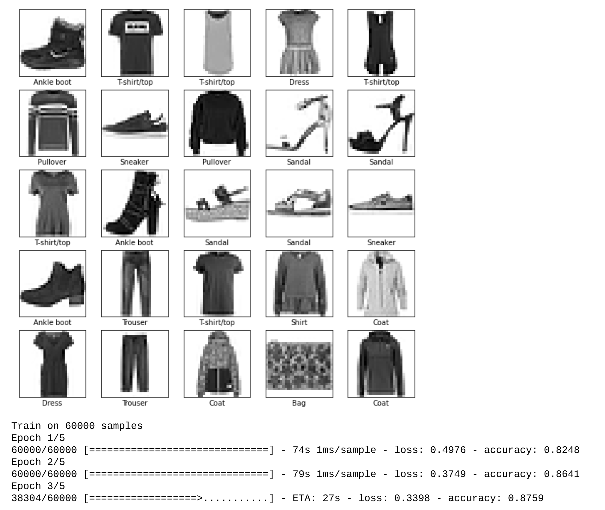
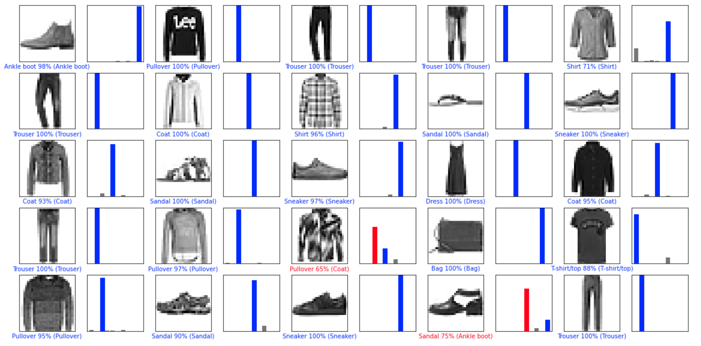

# Machine Learning Projects
AI, Data Science, Machine Learning projects.  

## Computer Vision: Clothing Recognition
Using TensorFlow, Keras to train and test a computer vision model in identifying different articles of clothing

### Sample of Training Set  
Images are preprocessed to grayscale to avoid confusing the model with colours.  
Model live-updates every epoch with training time, loss, and accuracy. It also has a nice little loading bar.
  

### Sample of Test Results
Graphic displays results with confidence levels, in blue for correct answers and red for incorrect answers.

